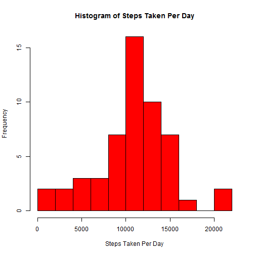
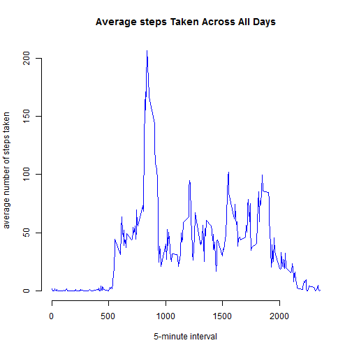
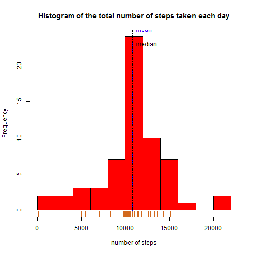

====================================

```r
# required packages
library(data.table)
library(lubridate)
library(lattice)

setwd("C:\\RCode")
# Create data folder if it does not exist.
if (!file.exists('data')) {
    dir.create('data')
}
```
# Loading and preprocessing the data

```r
activity<-read.csv('data/activity.csv',header=TRUE)
```

```
## Warning in file(file, "rt"): cannot open file 'data/activity.csv': No such
## file or directory
```

```
## Error in file(file, "rt"): cannot open the connection
```

```r
steps <- tapply(activity$steps, activity$date, sum)
hist(steps, breaks = 10, col = "red", main = "Histogram of Steps Taken Per Day", 
     xlab = "Steps Taken Per Day")
```

 

```r
#What is mean total number of steps taken per day?
meanTotalSteps <- mean(steps, na.rm = TRUE)
medianTotalSteps <- median(steps, na.rm = TRUE)
meanTotalSteps
```

```
## [1] 10766.19
```

```r
medianTotalSteps
```

```
## [1] 10765
```
#What is the average daily activity pattern?
#First get the average of steps per interval

```r
averageSteps <- tapply(activity$steps, activity$interval, mean, na.rm = TRUE)
intervalLevels <- as.numeric(levels(factor(activity$interval)))
plot(intervalLevels, averageSteps, type = "l", col = "blue", xlab = "5-minute interval", 
     ylab = "average number of steps taken", main = "Average steps Taken Across All Days", frame = F)
```

 

#Which 5-minute interval, on average across all the days in the dataset, contains the maximum number of steps?

```r
names(which.max(averageSteps))
```

```
## [1] "835"
```
#Imputing missing values

#Calculate and report the total number of missing values in the dataset (i.e. the total number of rows with NAs)

```r
nbrMissingValues <- sum(is.na(activity$steps))
nbrMissingValues
```

```
## [1] 2304
```

#Create a new dataset that is equal to the original dataset but with the missing data filled in.
#Strategy: Fill the missing value with the value from the same interval by using mod288.

```r
newDataSet <- activity
for( i in 1:dim(newDataSet)[1]){
    if(is.na(newDataSet$steps[i])){
        j <- i %%288
        if(j == 0){
            j <- 288
        }else{
            j <- i %%288
        }
        newDataSet$steps[i] <- averageSteps[j]
    }
}

newSteps <- tapply(newDataSet$steps, newDataSet$date, sum, na.rm= TRUE)
hist(newSteps,  breaks = 10, col = "red", xlab = "number of steps", main = "Histogram of the total number of steps taken each day")
abline(v=mean(newSteps), lty=3, col="blue")                      
abline(v=median(newSteps), lty=4, col="black")                   
text(mean(newSteps),25,labels="mean", pos=4, col="blue")         
text(mean(newSteps),23,labels="median", pos=4, col="black")        
rug(newSteps, col="chocolate")
```

 

#report the mean and median 

```r
newMean <- mean(newSteps)
newMedian <- median(newSteps)
newMean
```

```
## [1] 10766.19
```

```r
newMedian
```

```
## [1] 10766.19
```
#Are there differences in activity patterns between weekdays and weekends?

```r
newDataSet$date <- as.Date(strptime(newDataSet$date, format="%Y-%m-%d")) # convert date to a date() class variable  
newDataSet$day <- weekdays(newDataSet$date)                              # build a 'day' factor to hold weekday / weekend  
for (i in 1:nrow(newDataSet)) {                                       # for each day  
    if (newDataSet[i,]$day %in% c("Saturday","Sunday")) {             # if Saturday or Sunday,
        newDataSet[i,]$day<-"weekend"                                 #   then 'weekend'
    }
    else{
        newDataSet[i,]$day<-"weekday"                                 #    else 'weekday'
    }
}


stepsInterval2 = aggregate(steps ~ interval + day, newDataSet, mean)

xyplot(steps ~ interval | factor(day), data = stepsInterval2, aspect = 1/2, type = "l")
```

 
